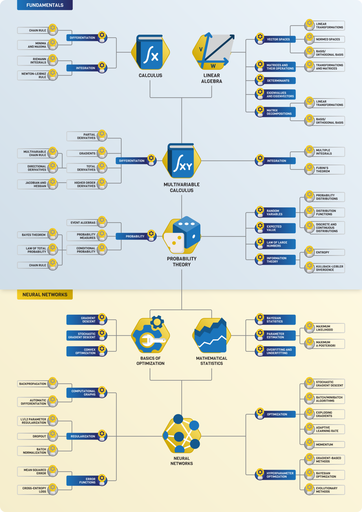

# My Life in Math:
* base on MML Book

## To Do:
  - search in youtube for algebra for ML
  - search in youtube for Math for ML
  - search in farsi web
  - add my notes to jupyter

## Algebra:
  * Resources:
    - Khan acadimi is [here](https://www.khanacademy.org/math/linear-algebra)
    - fastai course is <a href="https://github.com/fastai/numerical-linear-algebra/blob/master/README.md">here</a> 
    - 3brwon1blue is <a href="https://www.3blue1brown.com/essence-of-linear-algebra-page/">here</a> 
    - MIT course is <a href="https://ocw.mit.edu/courses/mathematics/18-06-linear-algebra-spring-2010/video-lectures/">here</a>

    - Persion:
      * matrix computation <a href="https://maktabkhooneh.org/course/308-%D9%85%D8%AD%D8%A7%D8%B3%D8%A8%D8%A7%D8%AA-%D9%85%D8%A7%D8%AA%D8%B1%DB%8C%D8%B3%DB%8C-mk308/">here<a>
      * linear algebra <a href="https://maktabkhooneh.org/course/18-%D8%AC%D8%A8%D8%B1-%D8%AE%D8%B7%DB%8C-mk18/">here</a>
      * math for data scinece [here](https://danup.ir/courses/principles-of-data-mining-and-machine-learning/)
  
  * concepts
    - Vector Space

## Probablity:
  - Resources:
    * robotech course
    * maktab engenring stats and prob [here](https://maktabkhooneh.org/course/%D8%A2%D9%85%D8%A7%D8%B1-%D8%A7%D8%AD%D8%AA%D9%85%D8%A7%D9%84-%D9%85%D9%87%D9%86%D8%AF%D8%B3%DB%8C-mk627/)
    * MIT [here](https://ocw.mit.edu/courses/electrical-engineering-and-computer-science/6-041-probabilistic-systems-analysis-and-applied-probability-fall-2010/video-lectures/)

## Optimization:
  - general math 1 in my Uni
  - base of nn is <a href="https://www.youtube.com/playlist?list=PLZHQObOWTQDNU6R1_67000Dx_ZCJB-3pi">here</a> 
  - MIT mutivar calculus is <a href="https://www.youtube.com/playlist?list=PL4C4C8A7D06566F38">here</a> 

## Resource:
  - math for machine learning book notebooks is <a href="https://github.com/mml-book/mml-book.github.io">here</a> 
  - D2ML chapter [Math](https://github.com/d2l-ai/d2l-en)
  
  

